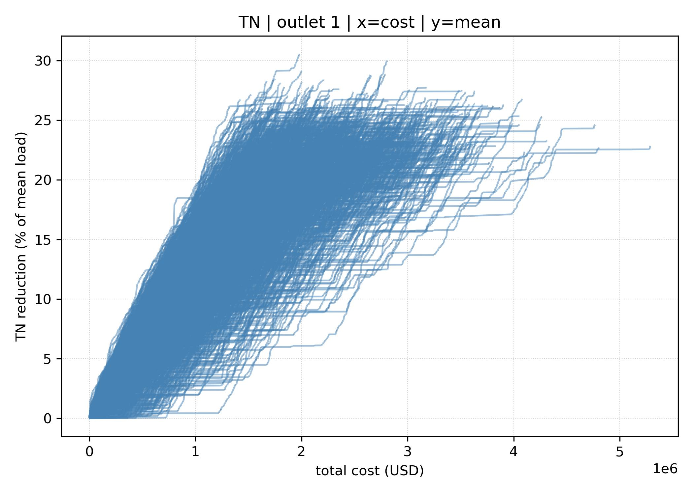
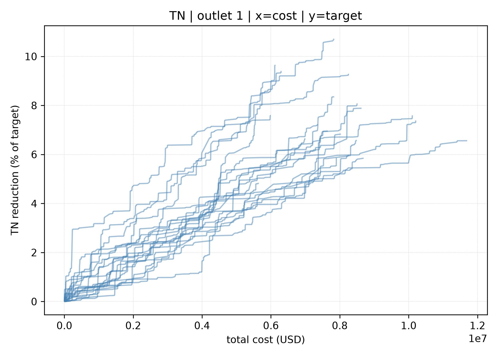
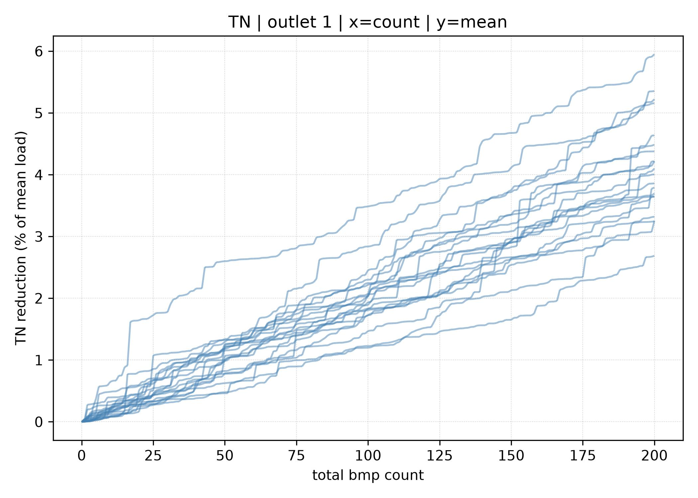
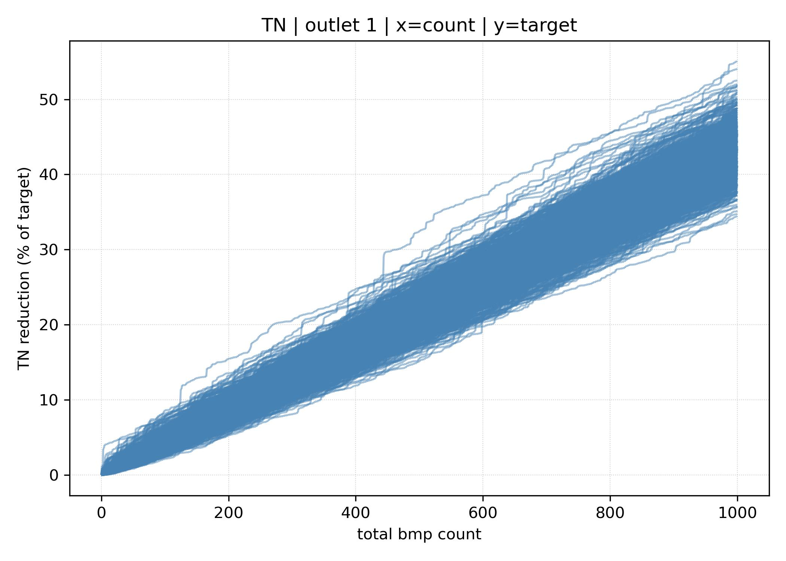

# BASIN-BMP-SCENARIO-SIMulator 

`basin-bmp-scenario-sim` is a probabilistic basin-scale best management practice (BMP) scenario simulator to assess the liklihood of cost-effectively meeting basin-scale pollutant load reduction targets

## Description

`basin-bmp-scenario-sim` facilitates Monte-Carlo-based simulation of basin-wide BMP implementation scenarios depicting aggregate costs and impacts on basin-outlet pollutant loads. The model is composed of a series of user-defined statistical distributions for:
- Parcel selection (i.e., the liklihood that specific parcels or agricultural fields will be selected to implement a BMP)
  - Parcel selection probabilities are passed as explicit inputs to the model. The user may elect to set selection probabilities by considering, as examples:
    - Agricultural productivity
    - Land value
    - Geospatial siting analysis (e.g., as provided by the Agricultural Conservation Productivity Framework [ACPF])   
- BMP / conservation practice type (i.e., the liklihood that specific types of BMPs or conservation practices will be implemented)
  -  BMP-type probabilities are passed as explicit inputs to the model. The user may elect to set BMP-type probabilities by considering, as examples:
    - Stakeholder preferences
    - BMP cost (on average)  
- BMP-specific characteristics (i.e., where a specific type of BMP is implemented, the likelihood of BMP-specific characteristics), e.g.:
  - Wetland area
    - Currently limited by selected parcel total area
    - Default minimum wetland area = 0.1 ha (0.25 ac) - reduced to parcel area if parcel area < 0.1 ha
  - Wetland catchment-to-area ratio
    - Currently <= 100:1 (100 areal-units catchment to 1 areal-unit wetland)
    - Currently limited by parcel upgraident area 
  - Grassed waterway length
    - Currently specified as percentages of parcel perimeter length 
  - Portion of parcel draining to the BMP
- Cost (i.e., the likely BMP implementation costs)
  - Annualized USD per unit area or length
  - May inlude opportunity, construction, maintenance
- Parcel pollutant yield (i.e., the likly of yield rates (e.g., kg/ha/yr) for specific pollutant types across basin parcels)
  - Optionally specify yields per pollutant loss pathway (e.g., surface, shallow surface, tile, deep subsurface)   
- BMP efficiency (i.e., the likly effectiveness of specific types of BMPs per pollutant type)
  - Optionally specify effectiveness per pollutant loss pathway (e.g., surface, shallow surface, tile, deep subsurface)
- BMP failure (i.e., the liklihood that a BMP will fail and the resulting decline in BMP effectiveness) 

## Configuration

Required configuration keys:

- `domain`: watershed boundary file (`.gpkg`, `.shp`, etc.)
- `parcels`: parcel polygons file
- `outlet_loc`: outlet location file
- `parcel_out`: CSV mapping parcels to outlet IDs
- `pollutants`: list of pollutant labels
- `cps`: list of BMP CPS codes
- `pollutant_yield`: CSV of pollutant yield statistics per parcel
- `bmp_efficiency`: CSV of BMP efficiency statistics per BMP type and pollutant
- `n_scenarios`: number of scenarios to produce
- one of `bmp_limit_n` or `bmp_limit_usd`

Optional configuration keys:

- `parcel_up`: CSV of parcel upstream connectivity
- `parcel_p`: parcel selection probability weights
- `bmp_cost`: CSV of BMP cost statistics
- `delivery_ratios`: CSV of parcel-to-outlet delivery ratios
- `outlet_target`: CSV of outlet pollutant reduction targets
- `outlet_mean`: CSV of outlet mean load metrics
- `buffer_depth_ft`: buffer depth in feet for grassed BMPs

## Outputs

The model writes results to the configured `outputs` directory:

- `bmps.csv` (aggregated across all scenarios, includes `scenario` and `cps_name`)
- `parcels.csv` (aggregated across all scenarios, includes `scenario`)
- `plot_*` files for summary visualizations
- `log.txt` (driver log for the overall run)
- `log_s{scenario}.txt` (per-scenario debug logs, one file per scenario)

Example output plots (each line depicts a single bmp scenario):









## Notes

- Pollutant labels are normalized from aliases such as `nitrogen`, `phosphorus`, and `sediment`.
- `parcel_out` outlet IDs must exist in `outlet_loc`.
- If both `bmp_limit_n` and `bmp_limit_usd` are specified, the simulation stops when either limit is reached.
- Optional representation of BMP failure

## Parallelization

The model can run scenarios in parallel using `joblib`. Configure parallel execution using the `parallel` config block (key: `parallel`). Supported options:

- `n_jobs` (int): number of worker processes to spawn (pass `-1` to use all CPUs). Default: `-1`.
- `max_nbytes` (str): memory threshold for memmapping objects to pass between workers (e.g. `"1M"`). Default: `"1M"`.
- `temp_folder` (str, optional): temporary directory for worker data used by `loky`.

Example `parallel` snippet in your YAML config:

```yaml
parallel:
  n_jobs: -1
  max_nbytes: "1M"
  temp_folder: "/tmp/bmp-loky"
```

When running with multiple workers, the driver writes `outputs/log.txt` while each scenario worker writes its own `outputs/log_s{scenario}.txt` file (e.g. `log_s1.txt`).

## Reproducibility (random seed)

To make runs reproducible, set `random_seed` in the config or pass `--seed` on the command line. A base seed is used to spawn per-scenario child seeds so each scenario remains deterministic across runs when the same base seed and config are used.

## CLI usage

Common command-line examples:

```bash
# Run with defaults from config
python run_model.py config.yaml

# Override outputs directory and run quietly
python run_model.py config.yaml --outputs ./outputs --quiet

# Force a deterministic run
python run_model.py config.yaml --seed 12345
```

### Contact

evenson.grey@epa.gov
